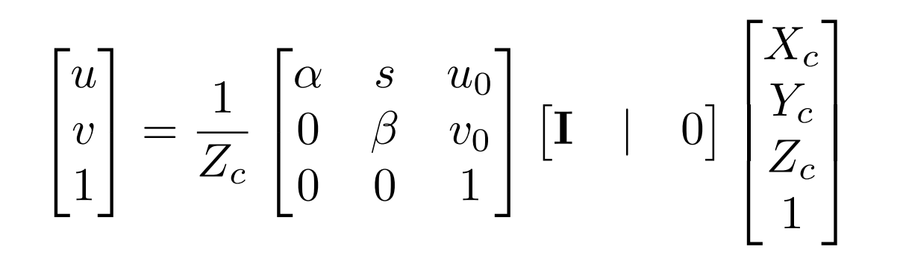

# Memos

[TOC]

## Dataset

### Format

The dataset is composed by several parts. original images/lidar in .jpeg and .bin files. e.g.:
`train_images/host-a004_cam0_1232815252251064006.jpeg`, `train_lidar/host-a004_lidar1_1232815252301696606.bin`. These files are all cooresponding to the `sample_data.json` file.

### Json format

1. sample_data
   - is_key_frame
   - prev
   - fileformat
   - token
   - timestamp
   - next
   - **ego_pose_token**
   - sample_token
   - filename
   - **calibrated_sensor_token**
2. sample_annotation
    - token
    - num_lidar_pts
    - size
    - sample_token
    - rotation
    - prev
    - translation
    - num_radar_pts
    - attribute_tokens
    - next
    - instance_token
    - visibility_token
3. attributes
    - description
    - token
    - name
4. calibrated_sensor
    - sensor_token
    - rotation
    - **camera_intrinsic**
    - translation
    - token

### Table names

- 9 category,
- 18 attribute,
- 4 visibility,
- 18421 instance,
- 10 sensor: 3 lidars and 7 cameras.
- 148 calibrated_sensor,
- 177789 ego_pose,
- 180 log,
- 180 scene,
- 22680 sample,
- 189504 sample_data,
- 638179 sample_annotation,
- 1 map

#### Table::Sample

Sample.keys():

- next
- prev
- token
- timestamp
- scene_token
- **data**
- anns

Sample['data'].keys():

1. CAM_BACK
2. **CAM_FRONT_ZOOMED**
3. CAM_FRONT
4. CAM_FRONT_LEFT
5. CAM_FRONT_RIGHT
6. CAM_BACK_RIGHT
7. CAM_BACK_LEFT
8. *LIDAR_FRONT_RIGHT*
9. *LIDAR_TOP*
10. *LIDAR_FRONT_LEFT*

#### Table::Sample_data

sample data as `LIDAR_TOP` & `LIDAR_FRONT_RIGHT` & `LIDAR_FRONT_LEFT`, keys:

1. is_key_frame
2. prev
3. fileformat
4. token
5. timestamp
6. next
7. ego_pose_token
8. sample_token
9. calibrated_sensor_token
10. filename
11. sensor_modality
12. channel

sample data as cameras, keys:

1. width
2. height
3. calibrated_sensor_token
4. token
5. sample_token
6. is_key_frame
7. prev
8. fileformat
9. ego_pose_token
10. timestamp
11. next
12. filename
13. sensor_modality
14. channel

sample data as image: token itself.

lidar render time: ~6.797s
image render time: ~1.175s

#### Table::Calibrated_sensor

calibrated sensor refers to the ego vehicle coordinates. It exists in both lidar and camera. It contains the translation and rotation **from** the sensor coord **to** the ego vehicle position.

keys:

- sensor_token
- rotation
- camera_intrinsic
- translation
- token

#### Table::Ego_pose

ego pose is for the ego vehicle coordinate system. It stores the rotation and translation of **from** the ego vehicle frame **to** the global world frame.

keys:

- rotation
- translation
- token
- timestamp

## Calibration

It should be the ego vehicle frame as the standard camera frame to ensure a relative uniform dataset, where the boundaries of the trainable area can be easily decided. Also the boxes are defined under the calibrated sensor table.

### Poses flow

Every sensor got its raw data stored, alongside with its timestamp and transformations info to other coordinate systems. Also two sensors got their calibrated coord adn ego vehicle pose respectively.

raw => calibrated_sensor (ego vehicle frame) => ego_pose (world frame)

If need to do the transformations backwards, we need to use to use T.inv, which goes by R.t() and -t in SE(3) implemented by quaternions in LyftDataset

### PC2Image

Point cloud => calibrated => global => global (cam) => calibrated => camera frame => image plane

By camera frame => image plane, use the `camera_intrinsic` in camera calibrated sensor, by adopting the function:  in function `view_points(points: np.ndarray, view: np.ndarray, normalize: bool) -> np.ndarray` from `lyft_dataset_sdk.utils.geometry_utils`.

average loading time: about 0.4s

## Target

Target is from the annotations, which are in the form of bounding boxes. The `data_classes` provide a class `Box` for the them. A box class can be generated from a sample_data token.

### Class Box

#### Attributes

Reimplemented `__eq__`, `__repr__`.

- center: np array (3,)
- label: always nan
- name: the label
- orientation: a Quaternion
- rotation_matrix: np array (3,3)
- score: nan
- token
- velocity
- wlh: size in width, length, height

#### Methods

1. `translate(x)`, x as np.float: 3, 1
2. `rotate(quaternion: Quaternion)`
3. `corners(wlh_factor: float)` which are bbox corners that the first four corners are the ones facing forward, and the last four are the ones facing backwards
4. `bottom_corners()` four of them
5. `render(axis)` as plt, and axis as plt.Axes
6. `render_cv2(image)` as cv2
7. `copy()`

## Function build

### IOU 3d from PointRCNN

By using CUDA and PYBIND from c++ to python, build the iou3d_cuda package which calculated the 3d ROI.

```bash
python setup.py install
```

Notice it required a corrected CUDA_HOME path in bashrc: `/usr/local/cuda/`. And the nvcc will correctly find include path with `<cuda.h>` and `<cuda_runtime.h>`

Methods in package 3droi_cuda:

1. boxes_iou_bev_gpu
2. boxes_overlap_bev_gpu
3. nms_gpu
4. nms_normal_gpu
